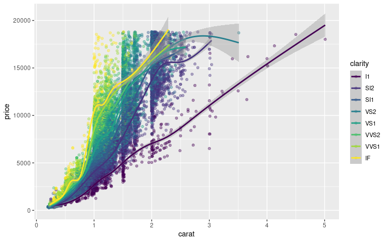
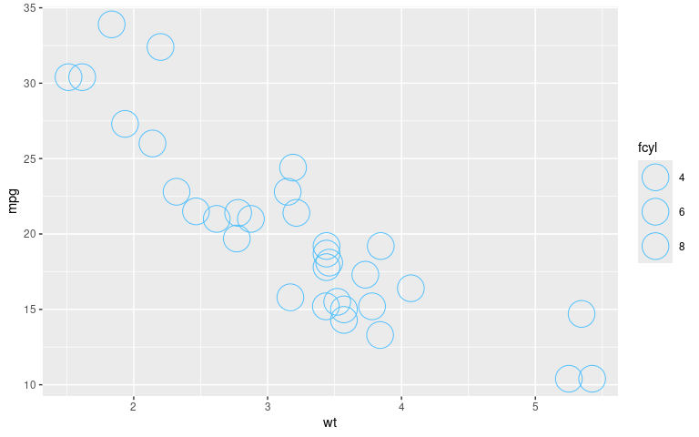
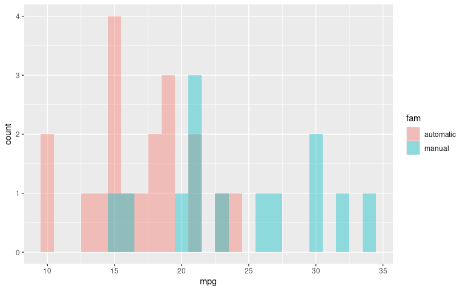
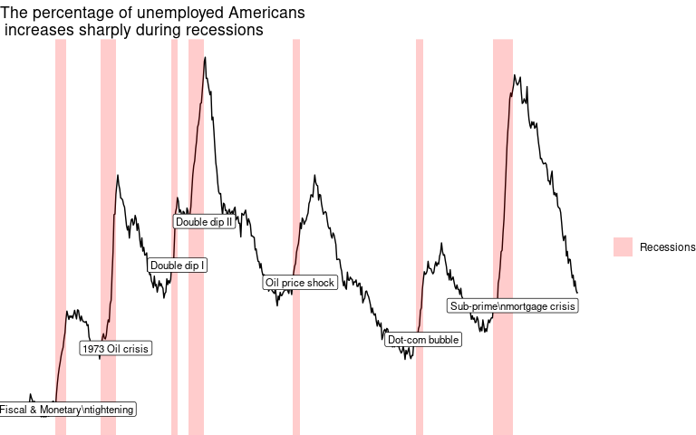

# Introduction

## Drawing your first plot

To get a first feel for `ggplot2`, let's try to run some basic `ggplot2`
commands. The `mtcars` dataset contains information on 32 cars from a
1973 issue of Motor Trend magazine. This dataset is small, intuitive,
and contains a variety of continuous and categorical variables.

**Instructions**

- Load the `ggplot2` package using `library()`.
- Use `str()` to explore the structure of the `mtcars` dataset.
- Submit the code. This will execute the example code. See if you can
  understand what `ggplot` does with the data.

**Answer**


``` r
# Load the ggplot2 package
library(ggplot2)

# Explore the mtcars data frame with str()
str(mtcars)
```

```
## 'data.frame':	32 obs. of  11 variables:
##  $ mpg : num  21 21 22.8 21.4 18.7 18.1 14.3 24.4 22.8 19.2 ...
##  $ cyl : num  6 6 4 6 8 6 8 4 4 6 ...
##  $ disp: num  160 160 108 258 360 ...
##  $ hp  : num  110 110 93 110 175 105 245 62 95 123 ...
##  $ drat: num  3.9 3.9 3.85 3.08 3.15 2.76 3.21 3.69 3.92 3.92 ...
##  $ wt  : num  2.62 2.88 2.32 3.21 3.44 ...
##  $ qsec: num  16.5 17 18.6 19.4 17 ...
##  $ vs  : num  0 0 1 1 0 1 0 1 1 1 ...
##  $ am  : num  1 1 1 0 0 0 0 0 0 0 ...
##  $ gear: num  4 4 4 3 3 3 3 4 4 4 ...
##  $ carb: num  4 4 1 1 2 1 4 2 2 4 ...
```

``` r
# Execute the following command
ggplot(mtcars, aes(cyl, mpg)) +
  geom_point()
```

<!-- -->

## Data columns types affect plot types

The plot from the previous exercise wasn't really satisfying. Although
`cyl` (the number of cylinders) is categorical, you probably noticed
that it is classified as numeric in `mtcars`. This is really misleading
because the representation in the plot doesn't match the actual data
type. You'll have to explicitly tell `ggplot2` that `cyl` is a
categorical variable.

**Instructions**

- Change the `ggplot()` command by wrapping `factor()` around `cyl`.
- Submit the code and see if the resulting plot is better this time.

**Answer**


``` r
# Load the ggplot2 package
library(ggplot2)

# Change the command below so that cyl is treated as factor
ggplot(mtcars, aes(factor(cyl), mpg)) +
  geom_point()
```

<!-- -->

## Mapping data columns to aesthetics

Let's dive a little deeper into the three main topics in this course:
The data, aesthetics, and geom layers. We'll get to making pretty plots
in the last chapter with the themes layer.

We'll continue working on the 32 cars in the `mtcars` data frame.

Consider how the examples and concepts we discuss throughout these
courses apply to your own data-sets!

**Instructions**

Add a color aesthetic mapped to the displacement of the car engine:
inside `aes()`, add a `color` argument equal to `disp`.

This time, map `disp` to the `size` aesthetic.

**Answer**


``` r
# Edit to add a color aesthetic mapped to disp
ggplot(mtcars, aes(wt, mpg, color = disp)) +
  geom_point()
```

<!-- -->


``` r
# Change the color aesthetic to a size aesthetic
ggplot(mtcars, aes(wt, mpg, size = disp)) +
  geom_point()
```

<!-- -->

## Adding geometries

The `diamonds` dataset contains details of 1,000 diamonds. Among the
variables included are `carat` (a measurement of the diamond's size) and
`price`.

You'll use two common geom layer functions:

- `geom_point()` adds points (as in a scatter plot).
- `geom_smooth()` adds a smooth trend curve.

As you saw previously, these are added using the `+` operator.

    ggplot(data, aes(x, y)) +
      geom_*()

Where `*` is the specific geometry needed.

**Instructions**

Explore the `diamonds` data frame with the `str()` function.

Edit the plot code to add a point geom. Use the `+` operator to add
`geom_point()` to the `ggplot()` command.

Add a smooth geom to the plot. Use the `+` operator to add
`geom_smooth()`.

**Answer**


``` r
# Explore the diamonds data frame with str()
str(diamonds)
```

```
## tibble [53,940 × 10] (S3: tbl_df/tbl/data.frame)
##  $ carat  : num [1:53940] 0.23 0.21 0.23 0.29 0.31 0.24 0.24 0.26 0.22 0.23 ...
##  $ cut    : Ord.factor w/ 5 levels "Fair"<"Good"<..: 5 4 2 4 2 3 3 3 1 3 ...
##  $ color  : Ord.factor w/ 7 levels "D"<"E"<"F"<"G"<..: 2 2 2 6 7 7 6 5 2 5 ...
##  $ clarity: Ord.factor w/ 8 levels "I1"<"SI2"<"SI1"<..: 2 3 5 4 2 6 7 3 4 5 ...
##  $ depth  : num [1:53940] 61.5 59.8 56.9 62.4 63.3 62.8 62.3 61.9 65.1 59.4 ...
##  $ table  : num [1:53940] 55 61 65 58 58 57 57 55 61 61 ...
##  $ price  : int [1:53940] 326 326 327 334 335 336 336 337 337 338 ...
##  $ x      : num [1:53940] 3.95 3.89 4.05 4.2 4.34 3.94 3.95 4.07 3.87 4 ...
##  $ y      : num [1:53940] 3.98 3.84 4.07 4.23 4.35 3.96 3.98 4.11 3.78 4.05 ...
##  $ z      : num [1:53940] 2.43 2.31 2.31 2.63 2.75 2.48 2.47 2.53 2.49 2.39 ...
```


``` r
# Add geom_point() with +
ggplot(diamonds, aes(carat, price)) +
  geom_point()
```

<!-- -->


``` r
# Add geom_smooth() with +
ggplot(diamonds, aes(carat, price)) +
  geom_point() +
  geom_smooth()
```

```
## `geom_smooth()` using method = 'gam' and formula = 'y ~ s(x, bs = "cs")'
```

<!-- -->

## Changing one geom or every geom

If you have multiple geoms, then mapping an aesthetic to data variable
inside the call to `ggplot()` will change *all* the geoms. It is also
possible to make changes to *individual* geoms by passing arguments to
the `geom_*()` functions.

`geom_point()` has an `alpha` argument that controls the opacity of the
points. A value of `1` (the default) means that the points are totally
opaque; a value of `0` means the points are totally transparent (and
therefore invisible). Values in between specify transparency.

The plot you drew last time is provided in the script.

**Instructions**

Edit the plot code to map the `color` aesthetic to the `clarity` data
variable.

Make the points translucent by setting the `alpha` argument to `0.4`.

**Answer**


``` r
# Map the color aesthetic to clarity
ggplot(diamonds, aes(carat, price, color = clarity)) +
  geom_point() +
  geom_smooth()
```

```
## `geom_smooth()` using method = 'gam' and formula = 'y ~ s(x, bs = "cs")'
```

<!-- -->


``` r
# Make the points 40% opaque
ggplot(diamonds, aes(carat, price, color = clarity)) +
  geom_point(alpha = 0.4) +
  geom_smooth()
```

```
## `geom_smooth()` using method = 'gam' and formula = 'y ~ s(x, bs = "cs")'
```

<!-- -->

## Saving plots as variables

Plots can be saved as variables, which can be added to later on using
the `+` operator. This is really useful if you want to make multiple
related plots from a common base.

**Instructions**

- Using the `diamonds` dataset, plot the `price` (y-axis) versus the
  `carat` (x-axis), assigning to `plt_price_vs_carat`.
- Using `geom_point()`, add a point layer to `plt_price_vs_carat`.
- Add an `alpha` argument to the point layer to make the points 20% opaque, assigning to `plt_price_vs_carat_transparent`.
- Type the plot's variable name (`plt_price_vs_carat_transparent`) to display it.
- Inside `geom_point()`, call `aes()` and map `color` to `clarity`, assigning to `plt_price_vs_carat_by_clarity`.
- Type the plot's variable name (`plt_price_vs_carat_by_clarity`) to display it.

**Answer**


``` r
# Draw a ggplot
plt_price_vs_carat <- ggplot(
  # Use the diamonds dataset
  diamonds,
  # For the aesthetics, map x to carat and y to price
  aes(carat, price)
)

# Add a point layer to plt_price_vs_carat
plt_price_vs_carat + geom_point()
```

<!-- -->


``` r
# From previous step
plt_price_vs_carat <- ggplot(diamonds, aes(carat, price))

# Edit this to make points 20% opaque: plt_price_vs_carat_transparent
plt_price_vs_carat_transparent <- plt_price_vs_carat + geom_point(alpha = 0.2)

# See the plot
plt_price_vs_carat_transparent
```

<!-- -->


``` r
# From previous step
plt_price_vs_carat <- ggplot(diamonds, aes(carat, price))

# Edit this to map color to clarity
# Assign the updated plot to a new object
plt_price_vs_carat_by_clarity <- plt_price_vs_carat + geom_point(aes(color = clarity))

# See the plot
plt_price_vs_carat_by_clarity
```

<!-- -->

# Aesthetics

## All about aesthetics: color, shape and size

In the video you saw 9 visible aesthetics. Let's apply them to a
categorical variable — the cylinders in `mtcars`, `cyl`.

These are the aesthetics you can consider within `aes()` in this
chapter: `x`, `y`, `color`, `fill`, `size`, `alpha`, `labels` and
`shape`.

One common convention is that you don't name the `x` and `y` arguments
to `aes()`, since they almost always come first, but you do name other
arguments.

In the following exercise the `fcyl` column is categorical. It is `cyl`
transformed into a `factor`.

**Instructions**

Map `mpg` onto the `x` aesthetic, and `fcyl` onto the `y`.

Swap the mappings of the first plot: `fcyl` onto the `x` aesthetic, and
`mpg` onto the `y`.

Map `wt` onto `x`, `mpg` onto `y`, and `fcyl` onto `color`.

Modify the point layer of the previous plot by changing the `shape`
argument to `1` and increasing the `size` to `4`.

**Answer**


``` r
library(tidyverse)
```

```
## ── Attaching core tidyverse packages ──────────────────────── tidyverse 2.0.0 ──
## ✔ dplyr     1.1.4     ✔ readr     2.1.5
## ✔ forcats   1.0.0     ✔ stringr   1.5.1
## ✔ lubridate 1.9.3     ✔ tibble    3.2.1
## ✔ purrr     1.0.2     ✔ tidyr     1.3.1
## ── Conflicts ────────────────────────────────────────── tidyverse_conflicts() ──
## ✖ dplyr::filter() masks stats::filter()
## ✖ dplyr::lag()    masks stats::lag()
## ℹ Use the conflicted package (<http://conflicted.r-lib.org/>) to force all conflicts to become errors
```

``` r
# added/edited by Sergio_Garcia
library(forcats)
mtcars <- mtcars %>%
  mutate(fcyl = as.factor(cyl),
         fam = as.factor(am)) %>%
  mutate(fam = fct_recode(fam,
                          "manual" = "1",
                          "automatic" = "0"))
```


``` r
# Map x to mpg and y to fcyl
ggplot(mtcars, aes(mpg, fcyl)) +
  geom_point()
```

<!-- -->


``` r
# Swap mpg and fcyl
ggplot(mtcars, aes(fcyl, mpg)) +
  geom_point()
```

<!-- -->


``` r
# Map x to wt, y to mpg and color to fcyl
ggplot(mtcars, aes(wt, mpg, color = fcyl)) +
  geom_point()
```

<!-- -->


``` r
ggplot(mtcars, aes(wt, mpg, color = fcyl)) +
  # Set the shape and size of the points
  geom_point(shape = 1, size = 4)
```

<!-- -->

## All about aesthetics: color vs. fill

Typically, the `color` aesthetic changes the *outline* of a geom and the
`fill` aesthetic changes the *inside*. `geom_point()` is an exception:
you use `color` (not `fill`) for the point color. However, some shapes
have special behavior.

The default `geom_point()` uses `shape = 19`: a solid circle. An
alternative is `shape = 21`: a circle that allow you to use *both*
`fill` for the inside *and* `color` for the outline. This is lets you to
map two aesthetics to each point.

All shape values are described on the `points()`
([docs](https://www.rdocumentation.org/packages/graphics/topics/points))
help page.

`fcyl` and `fam` are the `cyl` and `am` columns converted to factors,
respectively.

**Instructions**

Change the aesthetics so that `fcyl` maps to `fill` rather than `color`.

In `geom_point()` change the `shape` argument to `21` and add an `alpha`
argument set to `0.6`.

In the `ggplot()` aesthetics, map `fam` to `color`.

**Answer**


``` r
# Map fcyl to fill
ggplot(mtcars, aes(wt, mpg, fill = fcyl)) +
  geom_point(shape = 1, size = 4)
```

<!-- -->


``` r
ggplot(mtcars, aes(wt, mpg, fill = fcyl)) +
  # Change point shape; set alpha
  geom_point(shape = 21, size = 4, alpha = 0.6)
```

<!-- -->


``` r
# Map color to fam
ggplot(mtcars, aes(wt, mpg, fill = fcyl, color = fam)) +
  geom_point(shape = 21, size = 4, alpha = 0.6)
```

<!-- -->

## All about aesthetics: comparing aesthetics

Now that you've got some practice with using attributes, be careful of a
major pitfall: these attributes can overwrite the aesthetics of your
plot!

**Instructions**

- Using `mtcars`, create a plot base layer, `plt_mpg_vs_wt`. Map `mpg`
  onto `y` and `wt` onto `x`.
- Add a point layer, mapping the categorical no. of cylinders, `fcyl`,
  onto `size`.

Change the mapping. This time `fcyl` should be mapped onto `alpha`.

Change the mapping again. This time `fcyl` should be mapped onto
`shape`.

- Swap the geom layer: change points to text.
- Change the mapping again. This time `fcyl` should be mapped onto
  `label`.

**Answer**


``` r
# Establish the base layer
plt_mpg_vs_wt <- ggplot(mtcars, aes(wt, mpg))

# Map fcyl to size
plt_mpg_vs_wt +
  geom_point(aes(size = fcyl))  
```

```
## Warning: Using size for a discrete variable is not advised.
```

<!-- -->


``` r
# Base layer
plt_mpg_vs_wt <- ggplot(mtcars, aes(wt, mpg))

# Map fcyl to alpha, not size
plt_mpg_vs_wt +
  geom_point(aes(alpha = fcyl))
```

```
## Warning: Using alpha for a discrete variable is not advised.
```

<!-- -->


``` r
# Base layer
plt_mpg_vs_wt <- ggplot(mtcars, aes(wt, mpg))

# Map fcyl to shape, not alpha
plt_mpg_vs_wt +
  geom_point(aes(shape = fcyl))
```

<!-- -->


``` r
# Base layer
plt_mpg_vs_wt <- ggplot(mtcars, aes(wt, mpg))

# Use text layer and map fcyl to label
plt_mpg_vs_wt +
  geom_text(aes(label = fcyl))
```

<!-- -->

## All about attributes: color, shape, size and alpha

This time you'll use these arguments to set *attributes* of the plot,
not map variables onto *aesthetics*.

You can specify colors in R using **hex codes**: a hash followed by two
hexadecimal numbers each for red, green, and blue (`"#RRGGBB"`).
Hexadecimal is base-16 counting. You have 0 to 9, and A representing 10
up to F representing 15. Pairs of hexadecimal numbers give you a range
from 0 to 255. `"#000000"` is "black" (no color), `"#FFFFFF"` means
"white", and \`"#00FFFF" is cyan (mixed green and blue).

A hexadecimal color variable, `my_blue` has been defined for you.

**Instructions**

Set the point color to `my_blue` and the alpha to `0.6`.

- Change the `color` mapping to a `fill` mapping. That is, `fcyl` should
  be mapped onto `fill`.
- Set the `color` of the points to `my_blue`, point `size` to `10` and
  the point `shape` to `1`.

**Answer**


``` r
# A hexadecimal color
my_blue <- "#4ABEFF"

ggplot(mtcars, aes(wt, mpg)) +
  # Set the point color to my_blue
  geom_point(color = my_blue, alpha = 0.6)
```

<!-- -->


``` r
# A hexadecimal color
my_blue <- "#4ABEFF"

# Change the color mapping to a fill mapping
ggplot(mtcars, aes(wt, mpg, fill = fcyl)) +
  # Set point size to 10; shape to 1
  geom_point(color = my_blue, size = 10, shape = 1)
```

<!-- -->

## All about attributes: conflicts with aesthetics

In the videos you saw that you can use all the aesthetics as attributes.
Let's see how this works with the aesthetics you used in the previous
exercises: `x`, `y`, `color`, `fill`, `size`, `alpha`, `label` and
`shape`.

In this exercise you will set all kinds of attributes of the points!

You will continue to work with `mtcars`.

**Instructions**

Add a point layer, setting `alpha`, the transparency, to `0.5`.

Add a text layer, setting the `label` to the rownames of the dataset
`mtcars`, and the `color` to `"red"`.

Add a point layer, setting the `shape` to `24` and the `color` to
`"yellow"`.

**Answer**


``` r
ggplot(mtcars, aes(wt, mpg, color = fcyl)) +
  # Add point layer with alpha 0.5
  geom_point(alpha = 0.5)
```

<!-- -->


``` r
ggplot(mtcars, aes(wt, mpg, color = fcyl)) +
  # Add text layer with label rownames(mtcars) and color red
  geom_text(label = rownames(mtcars), color = 'red')
```

<!-- -->


``` r
ggplot(mtcars, aes(wt, mpg, color = fcyl)) +
  # Add points layer with shape 24 and color yellow
  geom_point(shape = 24, color = 'yellow')
```

<!-- -->

## Going all out

In this exercise, you will gradually add more aesthetics layers to the
plot. You're still working with the `mtcars` dataset, but this time
you're using more features of the cars. Each of the columns is described
on the `mtcars`
([docs](https://www.rdocumentation.org/packages/datasets/topics/mtcars))
help page. Columns `fcyl` and `fam` have been added (as before) as
categorical versions of `cyl` and `am` respectively.

Notice that adding more aesthetic mappings to your plot is not always a
good idea! You may just increase complexity and decrease readability.

**Instructions**

- Use `mtcars` to draw a plot of `qsec` vs. `mpg`, colored by `fcyl`.
- Add a point layer.

Add another aesthetic: map `fam` onto `shape`.

Add another two aesthetics: map `hp` *divided by* `wt` onto `size`.

**Answer**


``` r
# 3 aesthetics: qsec vs. mpg, colored by fcyl
ggplot(mtcars, aes(mpg, qsec, color = fcyl)) +
  geom_point()
```

<!-- -->


``` r
# 4 aesthetics: add a mapping of shape to fam
ggplot(mtcars, aes(mpg, qsec, color = fcyl, shape = fam)) +
  geom_point()
```

<!-- -->


``` r
# 5 aesthetics: add a mapping of size to hp / wt
ggplot(mtcars, aes(mpg, qsec, color = fcyl, shape = fam, size = hp / wt)) +
  geom_point()
```

<!-- -->

## Updating aesthetic labels

In this exercise, you'll modify some aesthetics to make a bar plot of
the number of cylinders for cars with different types of transmission.

You'll also make use of some functions for improving the appearance of
the plot.

- `labs()` to set the x- and y-axis labels. It takes strings for each
  argument.
- `scale_fill_manual()` defines properties of the color scale (i.e.
  axis). The first argument sets the legend title. `values` is a named
  vector of colors to use.

**Instructions**

Set the x-axis label to `"Number of Cylinders"`, and the y-axis label to
`"Count"` using the `x` and `y` arguments of `labs()`, respectively.

Implement a custom fill color scale using `scale_fill_manual()`. Set the
first argument to `"Transmission"`, and `values` to `palette`.

Modify the code to set the `position` to `dodge` so that the bars for
transmissions are displayed side by side.

**Answer**


``` r
ggplot(mtcars, aes(fcyl, fill = fam)) +
  geom_bar() +
  # Set the axis labels
  labs(x = "Number of Cylinders", y = "Count")
```

<!-- -->


``` r
palette <- c(automatic = "#377EB8", manual = "#E41A1C")

ggplot(mtcars, aes(fcyl, fill = fam)) +
  geom_bar() +
  labs(x = "Number of Cylinders", y = "Count")
```

<!-- -->

``` r
  # Set the fill color scale
  scale_fill_manual("Transmission", values = palette)
```

```
## <ggproto object: Class ScaleDiscrete, Scale, gg>
##     aesthetics: fill
##     axis_order: function
##     break_info: function
##     break_positions: function
##     breaks: waiver
##     call: call
##     clone: function
##     dimension: function
##     drop: TRUE
##     expand: waiver
##     get_breaks: function
##     get_breaks_minor: function
##     get_labels: function
##     get_limits: function
##     get_transformation: function
##     guide: legend
##     is_discrete: function
##     is_empty: function
##     labels: waiver
##     limits: function
##     make_sec_title: function
##     make_title: function
##     map: function
##     map_df: function
##     n.breaks.cache: NULL
##     na.translate: TRUE
##     na.value: grey50
##     name: Transmission
##     palette: function
##     palette.cache: NULL
##     position: left
##     range: environment
##     rescale: function
##     reset: function
##     train: function
##     train_df: function
##     transform: function
##     transform_df: function
##     super:  <ggproto object: Class ScaleDiscrete, Scale, gg>
```


``` r
palette <- c(automatic = "#377EB8", manual = "#E41A1C")

# Set the position
ggplot(mtcars, aes(fcyl, fill = fam)) +
  geom_bar(position = 'dodge') +
  labs(x = "Number of Cylinders", y = "Count")
```

<!-- -->

``` r
  scale_fill_manual("Transmission", values = palette)
```

```
## <ggproto object: Class ScaleDiscrete, Scale, gg>
##     aesthetics: fill
##     axis_order: function
##     break_info: function
##     break_positions: function
##     breaks: waiver
##     call: call
##     clone: function
##     dimension: function
##     drop: TRUE
##     expand: waiver
##     get_breaks: function
##     get_breaks_minor: function
##     get_labels: function
##     get_limits: function
##     get_transformation: function
##     guide: legend
##     is_discrete: function
##     is_empty: function
##     labels: waiver
##     limits: function
##     make_sec_title: function
##     make_title: function
##     map: function
##     map_df: function
##     n.breaks.cache: NULL
##     na.translate: TRUE
##     na.value: grey50
##     name: Transmission
##     palette: function
##     palette.cache: NULL
##     position: left
##     range: environment
##     rescale: function
##     reset: function
##     train: function
##     train_df: function
##     transform: function
##     transform_df: function
##     super:  <ggproto object: Class ScaleDiscrete, Scale, gg>
```

## Setting a dummy aesthetic

In the last chapter you saw that all the visible aesthetics can serve as
attributes and aesthetics, but I very conveniently left out x and y.
That's because although you can make univariate plots (such as
histograms, which you'll get to in the next chapter), a y-axis will
always be provided, even if you didn't ask for it.

You can make univariate plots in `ggplot2`, but you will need to add a
fake y axis by mapping `y` to zero.

When using setting y-axis limits, you can specify the limits as separate
arguments, or as a single numeric vector. That is, `ylim(lo, hi)` or
`ylim(c(lo, hi))`.

**Instructions**

- Using `mtcars`, plot `0` vs. `mpg`.
- Make a scatter plot and add `"jitter"` to it.

Use `ylim()` to set the limits on the y-axis from `-2` to `2`.

**Answer**


``` r
# Plot 0 vs. mpg
ggplot(mtcars, aes(mpg, 0)) +
  # Add jitter
  geom_point(position="jitter")
```

<!-- -->


``` r
ggplot(mtcars, aes(mpg, 0)) +
  geom_jitter() +
  # Set the y-axis limits from -2 to 2
  ylim(-2, 2)
```

<!-- -->

# Geometries

## Overplotting 1: large datasets

Scatter plots (using `geom_point()`) are intuitive, easily understood,
and very common, but we must *always* consider **overplotting**,
particularly in the following four situations:

1.  Large datasets
2.  Aligned values on a single axis
3.  Low-precision data
4.  Integer data

Typically, *alpha* blending (i.e. adding transparency) is recommended
when using solid shapes. Alternatively, you can use opaque, hollow
shapes.

Small points are suitable for large datasets with regions of high
density (lots of overlapping).

Let's use the `diamonds` dataset to practice dealing with the large
dataset case.

**Instructions**

Add a points layer to the base plot.

- Set the point transparency to `0.5`.
- Set `shape = "."`, the point size of 1 pixel.

Update the point shape to remove the line outlines by setting `shape` to
`16`.

**Answer**


``` r
# Plot price vs. carat, colored by clarity
plt_price_vs_carat_by_clarity <- ggplot(diamonds, aes(carat, price, color = clarity))

# Add a point layer with tiny points
plt_price_vs_carat_by_clarity + geom_point(alpha = 0.5, shape = ".")
```

<!-- -->


``` r
# Plot price vs. carat, colored by clarity
plt_price_vs_carat_by_clarity <- ggplot(diamonds, aes(carat, price, color = clarity))

# Set transparency to 0.5
plt_price_vs_carat_by_clarity + geom_point(alpha = 0.5, shape = 16)
```

<!-- -->

## Overplotting 2: Aligned values

Let's take a look at another case where we should be aware of
overplotting: Aligning values on a single axis.

This occurs when one axis is continuous and the other is categorical,
which can be overcome with some form of jittering.

In the `mtcars` data set, `fam` and `fcyl` are categorical variants of
`cyl` and `am`.

**Instructions**

- Create a base plot `plt_mpg_vs_fcyl_by_fam` of `fcyl` by `mpg`,
  colored by `fam`.
- Add a points layer to the base plot.

Add some jittering by using `position_jitter()`, setting the `width` to
`0.3`.

Alternatively, use `position_jitterdodge()`. Set `jitter.width` and
`dodge.width` to `0.3` to separate subgroups further.

**Answer**


``` r
# Plot base
plt_mpg_vs_fcyl_by_fam <- ggplot(mtcars, aes(fcyl, mpg, color = fam))

# Default points are shown for comparison
plt_mpg_vs_fcyl_by_fam + geom_point()
```

<!-- -->


``` r
# Alter the point positions by jittering, width 0.3
plt_mpg_vs_fcyl_by_fam + geom_point(position = position_jitter(width = 0.3))
```

<!-- -->


``` r
# Now jitter and dodge the point positions
plt_mpg_vs_fcyl_by_fam + geom_point(position = position_jitterdodge(jitter.width = 0.3, dodge.width = 0.3))
```

<!-- -->

## Overplotting 3: Low-precision data

You already saw how to deal with overplotting when using `geom_point()`
in two cases:

1.  Large datasets
2.  Aligned values on a single axis

We used `position = 'jitter'` inside `geom_point()` or `geom_jitter()`.

Let's take a look at another case:

1.  Low-precision data

This results from low-resolution measurements like in the iris dataset,
which is measured to 1mm precision (see viewer). It's similar to case 2,
but in this case we can jitter on both the x and y axis.

**Instructions**

- Change the points layer into a jitter layer.
- Reduce the jitter layer's width by setting the `width` argument to
  `0.1`.

Let's use a different approach:

- Within `geom_point()`, set `position` to `"jitter"`.

Provide an alternative specification:

- Have the `position` argument call `position_jitter()` with a `width`
  of `0.1`.

**Answer**


``` r
ggplot(iris, aes(Sepal.Length, Sepal.Width, color = Species)) +
  # Swap for jitter layer with width 0.1
  geom_jitter(alpha = 0.5, width = 0.1)
```

<!-- -->


``` r
ggplot(iris, aes(Sepal.Length, Sepal.Width, color = Species)) +
  # Set the position to jitter
  geom_point(alpha = 0.5, position = "jitter")
```

<!-- -->


``` r
ggplot(iris, aes(Sepal.Length, Sepal.Width, color = Species)) +
  # Use a jitter position function with width 0.1
  geom_point(alpha = 0.5, position = position_jitter(width = 0.1))
```

<!-- -->

## Overplotting 4: Integer data

Let's take a look at the last case of dealing with overplotting:

1.  Integer data

This can be type `integer` (i.e. 1 ,2, 3…) or categorical (i.e. class
`factor`) variables. `factor` is just a special class of type `integer`.

You'll typically have a small, defined number of intersections between
two variables, which is similar to case 3, but you may miss it if you
don't realize that integer and factor data are the same as low precision
data.

The `Vocab` dataset provided contains the years of education and
vocabulary test scores from respondents to US General Social Surveys
from 1972-2004.

**Instructions**

- Examine the `Vocab` dataset using `str()`.
- Using `Vocab`, draw a plot of `vocabulary` vs `education`.
- Add a point layer.

<!-- -->

- Replace the point layer with a jitter layer.

<!-- -->

- Set the jitter transparency to `0.2`.

<!-- -->

- Set the shape of the jittered points to hollow circles, (shape `1`).

**Answer**


``` r
# added/edited
library(carData)
```


``` r
# Examine the structure of Vocab
str(Vocab)
```

```
## 'data.frame':	30351 obs. of  4 variables:
##  $ year      : num  1974 1974 1974 1974 1974 ...
##  $ sex       : Factor w/ 2 levels "Female","Male": 2 2 1 1 1 2 2 2 1 1 ...
##  $ education : num  14 16 10 10 12 16 17 10 12 11 ...
##  $ vocabulary: num  9 9 9 5 8 8 9 5 3 5 ...
##  - attr(*, "na.action")= 'omit' Named int [1:32115] 1 2 3 4 5 6 7 8 9 10 ...
##   ..- attr(*, "names")= chr [1:32115] "19720001" "19720002" "19720003" "19720004" ...
```

``` r
# Plot vocabulary vs. education
ggplot(Vocab, aes(education, vocabulary)) +
  # Add a point layer
  geom_point()
```

<!-- -->


``` r
ggplot(Vocab, aes(education, vocabulary)) +
  # Change to a jitter layer
  geom_jitter()
```

<!-- -->


``` r
ggplot(Vocab, aes(education, vocabulary)) +
  # Set the transparency to 0.2
  geom_jitter(alpha = 0.2)
```

<!-- -->


``` r
ggplot(Vocab, aes(education, vocabulary)) +
  # Set the shape to 1
  geom_jitter(alpha = 0.2, shape = 1)
```

<!-- -->

## Drawing histograms

Recall that histograms cut up a continuous variable into discrete bins
and, by default, maps the internally calculated `count` variable (the
number of observations in each bin) onto the y aesthetic. An internal
variable called `density` can be accessed by using the `..` notation,
i.e. `..density..`. Plotting this variable will show the relative
frequency, which is the height times the width of each bin.

**Instructions**

- Using `mtcars`, map `mpg` onto the x aesthetic.
- Add a histogram layer using `geom_histogram()`.

<!-- -->

- Set the histogram `binwidth` to `1`.

<!-- -->

- Map `y` to the internal variable `..density..` to show frequency
  densities.

<!-- -->

- Set the `fill` color of the histogram bars to `datacamp_light_blue`.

**Answer**


``` r
# Plot mpg
ggplot(mtcars, aes(mpg)) +
  # Add a histogram layer
  geom_histogram()
```

```
## `stat_bin()` using `bins = 30`. Pick better value with `binwidth`.
```

<!-- -->


``` r
ggplot(mtcars, aes(mpg)) +
  # Set the binwidth to 1
  geom_histogram(binwidth = 1)
```

<!-- -->


``` r
# Map y to ..density..
ggplot(mtcars, aes(mpg, ..density..)) +
  geom_histogram(binwidth = 1)
```

```
## Warning: The dot-dot notation (`..density..`) was deprecated in ggplot2 3.4.0.
## ℹ Please use `after_stat(density)` instead.
## This warning is displayed once every 8 hours.
## Call `lifecycle::last_lifecycle_warnings()` to see where this warning was
## generated.
```

<!-- -->


``` r
datacamp_light_blue <- "#51A8C9"

ggplot(mtcars, aes(mpg, ..density..)) +
  # Set the fill color to datacamp_light_blue
  geom_histogram(binwidth = 1, fill = datacamp_light_blue)
```

<!-- -->

## Positions in histograms

Here, we'll examine the various ways of applying positions to
histograms. `geom_histogram()`, a special case of `geom_bar()`, has a
`position` argument that can take on the following values:

- `stack` (the default): Bars for different groups are stacked on top of
  each other.
- `dodge`: Bars for different groups are placed side by side.
- `fill`: Bars for different groups are shown as proportions.
- `identity`: Plot the values as they appear in the dataset.

**Instructions**

Update the aesthetics so that the fill color of the bars is determined
by `fam`.

Update the histogram layer to position the bars side-by-side, that is,
`"dodge"`.

Update the histogram layer so the bars' positions `"fill"` the y-axis.

Update the histogram layer so bars are on top of each other, using the
`"identity"` position. So each bar can be seen, set `alpha` to `0.4`.

**Answer**


``` r
# Update the aesthetics so the fill color is by fam
ggplot(mtcars, aes(mpg, fill = fam)) +
  geom_histogram(binwidth = 1)
```

<!-- -->


``` r
ggplot(mtcars, aes(mpg, fill = fam)) +
  # Change the position to dodge
  geom_histogram(binwidth = 1, position = "dodge")
```

<!-- -->


``` r
ggplot(mtcars, aes(mpg, fill = fam)) +
  # Change the position to fill
  geom_histogram(binwidth = 1, position = "fill")
```

```
## Warning: Removed 16 rows containing missing values or values outside the scale range
## (`geom_bar()`).
```

<!-- -->


``` r
ggplot(mtcars, aes(mpg, fill = fam)) +
  # Change the position to identity, with transparency 0.4
  geom_histogram(binwidth = 1, position = "identity", alpha = 0.4)
```

<!-- -->

## Position in bar and col plots

Let's see how the `position` argument changes `geom_bar()`.

We have three position options:

- `stack`: The default
- `dodge`: Preferred
- `fill`: To show proportions

While we will be using `geom_bar()` here, note that the function
`geom_col()` is just `geom_bar()` where both the `position` and `stat`
arguments are set to `"identity"`. It is used when we want the heights
of the bars to represent the exact values in the data.

In this exercise, you'll draw the total count of cars having a given
number of cylinders (`fcyl`), according to manual or automatic
transmission type (`fam`).

**Instructions**

- Using `mtcars`, plot `fcyl`, filled by `fam`.
- Add a bar layer using `geom_bar()`.

Set the bar `position` argument to `"fill"`.

Change the bar `position` argument to `"dodge"`.

**Answer**


``` r
# Plot fcyl, filled by fam
ggplot(mtcars, aes(fcyl, fill = fam)) +
  # Add a bar layer
  geom_bar()
```

<!-- -->


``` r
ggplot(mtcars, aes(fcyl, fill = fam)) +
  # Set the position to "fill"
  geom_bar(position = "fill")
```

<!-- -->


``` r
ggplot(mtcars, aes(fcyl, fill = fam)) +
  # Change the position to "dodge"
  geom_bar(position = "dodge")
```

<!-- -->

## Overlapping bar plots

You can customize bar plots further by adjusting the dodging so that
your bars partially overlap each other. Instead of using
`position = "dodge"`, you're going to use `position_dodge()`, like you
did with `position_jitter()` in the the previous exercises. Here, you'll
save this as an object, `posn_d`, so that you can easily reuse it.

Remember, the reason you want to use `position_dodge()` (and
`position_jitter()`) is to specify *how much* dodging (or jittering) you
want.

For this example, you'll use the `mtcars` dataset.

**Instructions**

- Use the functional form of the bar position: replace `"dodge"` with a
  call to `position_dodge()`.
- Set its `width` to `0.2`.

<!-- -->

- Set the bar transparency level of the bars to `0.6`.

**Answer**


``` r
ggplot(mtcars, aes(cyl, fill = fam)) +
  # Change position to use the functional form, with width 0.2
  geom_bar(position = position_dodge(width = 0.2))
```

<!-- -->


``` r
ggplot(mtcars, aes(cyl, fill = fam)) +
  # Set the transparency to 0.6
  geom_bar(position = position_dodge(width = 0.2), alpha = 0.6)
```

<!-- -->

## Bar plots: sequential color palette

In this bar plot, we'll fill each segment according to an ordinal
variable. The best way to do that is with a sequential color palette.

Here's an example of using a sequential color palette with the `mtcars`
dataset:

    ggplot(mtcars, aes(fcyl, fill = fam)) +
      geom_bar() +
      scale_fill_brewer(palette = "Set1")

In the exercise, you'll use similar code on the the `Vocab` dataset.
Both datasets are **ordinal**.

**Instructions**

- Plot the `Vocab` dataset, mapping `education` onto `x` and
  `vocabulary` onto `fill`.
- Add a bar layer, setting `position` to `"fill"`.
- Add a brewer fill scale, using the default palette (don't pass any arguments). Notice how this generates a warning message and an incomplete plot.

**Answer**


``` r
# added/edited by Sergio_Garcia
Vocab = Vocab %>% 
  mutate(vocabulary = as.factor(vocabulary))
```


``` r
# Plot education, filled by vocabulary
ggplot(Vocab, aes(education, fill = vocabulary))
```

<!-- -->


``` r
# Plot education, filled by vocabulary
ggplot(Vocab, aes(education, fill = vocabulary)) +
  # Add a bar layer with position "fill"
  geom_bar(position = "fill")
```

<!-- -->


``` r
# Plot education, filled by vocabulary
ggplot(Vocab, aes(education, fill = vocabulary)) +
  # Add a bar layer with position "fill"
  geom_bar(position = "fill") +
  # Add a brewer fill scale with default palette
  scale_fill_brewer()
```

```
## Warning in RColorBrewer::brewer.pal(n, pal): n too large, allowed maximum for palette Blues is 9
## Returning the palette you asked for with that many colors
```

<!-- -->

## Basic line plots

Here, we'll use the `economics` dataset to make some line plots. The
dataset contains a time series for unemployment and population
statistics from the Federal Reserve Bank of St. Louis in the United
States. The data is contained in the `ggplot2` package.

To begin with, you can look at how the median unemployment time and the
unemployment rate (the number of unemployed people as a proportion of
the population) change over time.

**Instructions**

- Print the head of the `economics` dataset.
- Plot `unemploy` vs. `date` as a line plot.

<!-- -->

- Adjust the y-axis aesthetic of the plot so that it represents the
  proportion of the `pop`ulation that is `unemploy`ed.

**Answer**


``` r
# Print the head of economics
head(economics)
```

```
## # A tibble: 6 × 6
##   date         pce    pop psavert uempmed unemploy
##   <date>     <dbl>  <dbl>   <dbl>   <dbl>    <dbl>
## 1 1967-07-01  507. 198712    12.6     4.5     2944
## 2 1967-08-01  510. 198911    12.6     4.7     2945
## 3 1967-09-01  516. 199113    11.9     4.6     2958
## 4 1967-10-01  512. 199311    12.9     4.9     3143
## 5 1967-11-01  517. 199498    12.8     4.7     3066
## 6 1967-12-01  525. 199657    11.8     4.8     3018
```

``` r
# Using economics, plot unemploy vs. date
ggplot(economics, aes(date, unemploy)) +
  # Make it a line plot
  geom_line()
```

<!-- -->


``` r
# Change the y-axis to the proportion of the population that is unemployed
ggplot(economics, aes(date, unemploy / pop)) +
  geom_line()
```

<!-- -->

## Multiple time series

We already saw how the form of your data affects how you can plot it.
Let's explore that further with multiple time series. Here, it's
important that all lines are on the same scale, and if possible, on the
same plot.

`fish.species` contains the global capture rates of seven salmon species
from 1950–2010. Each variable (column) is a Salmon species and each
observation (row) is one year. `fish.tidy` contains the same data, but
in three columns: `Species`, `Year`, and `Capture` (i.e. one variable
per column).

**Instructions**

- Use `str()` in the console to examine the structure of both
  `fish.species` and `fish.tidy`.
- Plot only the `Rainbow` salmon time series with `geom_line()`.
- Plot only the `Pink` salmon time series with `geom_line()`.

Now try and plot all time series in a single plot.

- Plot the `fish.tidy` dataset, mapping `Year` to `x` and `Capture` to `y`.
- `group` by fish species within the aesthetics of `geom_line()`.

Let's add color to the previous plot to distinguish between the different time series.

- Plot the `fish.tidy` dataset again, this time making sure to `color` by `Species`.

**Answer**


``` r
# added/edited
load("fish.RData")
fish.tidy <- gather(fish.species, Species, Capture, -Year)
```


``` r
# Plot the Rainbow Salmon time series
ggplot(fish.species, aes(x = Year, y = Rainbow)) +
  geom_line()
```

<!-- -->


``` r
# Plot the Pink Salmon time series
ggplot(fish.species, aes(x = Year, y = Pink)) +
  geom_line()
```

<!-- -->


``` r
# Plot multiple time-series by grouping by species
ggplot(fish.tidy, aes(Year, Capture)) +
  geom_line(aes(group = Species))
```

<!-- -->


``` r
# Plot multiple time-series by coloring by species
ggplot(fish.tidy, aes(Year, Capture, color = Species)) +
  geom_line()
```

<!-- -->

# Themes

## Moving the legend

Let's wrap up this course by making a publication-ready plot
communicating a clear message.

To change stylistic elements of a plot, call `theme()` and set plot
properties to a new value. For example, the following changes the legend
position.

    p + theme(legend.position = new_value)

Here, the new value can be

- `"top"`, `"bottom"`, `"left"`, or `"right'"`: place it at that side of
  the plot.
- `"none"`: don't draw it.
- `c(x, y)`: `c(0, 0)` means the bottom-left and `c(1, 1)` means the
  top-right.

Let's revisit the recession period line plot (assigned to
`plt_prop_unemployed_over_time`).

**Instructions**

- Update the plot to remove the legend.
- *Look at the changes in the plot.*

<!-- -->

- Update the plot to position the legend at the bottom of the plot.
- *Look at the changes in the plot.*

<!-- -->

- Position the legend inside the plot, with x-position `0.6` and
  y-position `0.1`.
- *Look at the changes in the plot.*

**Answer**


``` r
# added/edited by Sergio_Garcia
library(lubridate)
recess <- read.csv("recess.csv") %>%
  mutate(begin = ymd(begin), end = ymd(end))
plt_prop_unemployed_over_time <-
  ggplot(economics, aes(x = date, y = unemploy / pop)) +
  ggtitle(c(
    "The percentage of unemployed Americans \n increases sharply during recessions"
  )) +
  geom_line() +
  geom_rect(
    data = recess,
    aes(
      xmin = begin,
      xmax = end,
      ymin = -Inf,
      ymax = +Inf,
      fill = "Recession"
    ),
    inherit.aes = FALSE,
    alpha = 0.2
  ) +
  geom_label(data = recess, aes(x = end, y = y, label = event), size = 3) +
  scale_fill_manual(name = "",
                    values = "red",
                    label = "Recessions")
```


``` r
# View the default plot
plt_prop_unemployed_over_time
```

<!-- -->

``` r
# Remove legend entirely
plt_prop_unemployed_over_time +
  theme(legend.position = "none")
```

<!-- -->


``` r
# Position the legend at the bottom of the plot
plt_prop_unemployed_over_time +
  theme(legend.position = "bottom")
```

<!-- -->


``` r
# Position the legend inside the plot at (0.6, 0.1)
plt_prop_unemployed_over_time +
  theme(legend.position = c(0.6, 0.1))
```

```
## Warning: A numeric `legend.position` argument in `theme()` was deprecated in ggplot2
## 3.5.0.
## ℹ Please use the `legend.position.inside` argument of `theme()` instead.
## This warning is displayed once every 8 hours.
## Call `lifecycle::last_lifecycle_warnings()` to see where this warning was
## generated.
```

<!-- -->

## Modifying theme elements

Many plot elements have multiple properties that can be set. For
example, line elements in the plot such as axes and gridlines have a
color, a thickness (`size`), and a line type (solid line, dashed, or
dotted). To set the style of a line, you use `element_line()`. For
example, to make the axis lines into red, dashed lines, you would use
the following.

    p + theme(axis.line = element_line(color = "red", linetype = "dashed"))

Similarly, `element_rect()` changes rectangles and `element_text()`
changes text. You can remove a plot element using `element_blank()`.

`plt_prop_unemployed_over_time` is available.

**Instructions**

- Give all rectangles in the plot, (the `rect` element) a `fill` color
  of `"grey92"` (very pale grey).
- Remove the `legend.key`'s outline by setting its `color` to be
  missing.
- *Look at the changes in the plot.*
- Remove the axis ticks, `axis.ticks` by making them a blank element.
- Remove the panel gridlines, `panel.grid` in the same way.
- *Look at the changes in the plot.*
- Add the major horizontal grid lines back to the plot using `panel.grid.major.y`.
- Set the line `color` to `"white"`, `size` to `0.5`, and `linetype` to "dotted".
- *Look at the changes in the plot.*
- Make the axis tick labels' text, `axis.text`, less prominent by changing the color to `"grey25"`.
- Increase the `plot.title`'s, `size` to `16` and change its font `face` to `"italic"`.
- *Look at the changes in the plot.*

**Answer**


``` r
plt_prop_unemployed_over_time +
  theme(
    # For all rectangles, set the fill color to grey92
    rect = element_rect(fill = "grey92"),
    # For the legend key, turn off the outline
    legend.key = element_rect(color = NA)
  )
```

<!-- -->


``` r
plt_prop_unemployed_over_time +
  theme(
    rect = element_rect(fill = "grey92"),
    legend.key = element_rect(color = NA),
    # Turn off axis ticks
    axis.ticks = element_blank(),
    # Turn off the panel grid
    panel.grid = element_blank()
  )
```

<!-- -->


``` r
plt_prop_unemployed_over_time +
  theme(
    rect = element_rect(fill = "grey92"),
    legend.key = element_rect(color = NA),
    axis.ticks = element_blank(),
    panel.grid = element_blank(),
    # Add major y-axis panel grid lines back
    panel.grid.major.y = element_line(
      # Set the color to white
      color = "white",
      # Set the size to 0.5
      size = 0.5,
      # Set the line type to dotted
      linetype = "dotted"
    )
  )
```

```
## Warning: The `size` argument of `element_line()` is deprecated as of ggplot2 3.4.0.
## ℹ Please use the `linewidth` argument instead.
## This warning is displayed once every 8 hours.
## Call `lifecycle::last_lifecycle_warnings()` to see where this warning was
## generated.
```

<!-- -->


``` r
plt_prop_unemployed_over_time +
  theme(
    rect = element_rect(fill = "grey92"),
    legend.key = element_rect(color = NA),
    axis.ticks = element_blank(),
    panel.grid = element_blank(),
    panel.grid.major.y = element_line(
      color = "white",
      size = 0.5,
      linetype = "dotted"
    ),
    # Set the axis text color to grey25
    axis.text = element_text(color = "grey25"),
    # Set the plot title font face to italic and font size to 16
    plot.title = element_text(face = "italic", size = 16)
  )
```

<!-- -->

## Modifying whitespace

**Whitespace** means all the non-visible margins and spacing in the
plot.

To set a single whitespace value, use `unit(x, unit)`, where `x` is the
amount and `unit` is the unit of measure.

Borders require you to set 4 positions, so use
`margin(top, right, bottom, left, unit)`. To remember the margin order,
think **TRouBLe**.

The default unit is `"pt"` (points), which scales well with text. Other
options include "cm", "in" (inches) and "lines" (of text).

`plt_mpg_vs_wt_by_cyl` is available. The panel and legend are wrapped in
blue boxes so you can see how they change.

**Instructions**

- Give the axis tick length, `axis.ticks.length`, a unit of `2`
  `"lines"`.

<!-- -->

- Give the legend key size, `legend.key.size`, a unit of `3` centimeters
  (`"cm"`).

<!-- -->

- Set the `legend.margin` to `20` points (`"pt"`) on the top, `30` pts
  on the right, `40` pts on the bottom, and `50` pts on the left.

<!-- -->

- Set the plot margin, `plot.margin`, to `10`, `30`, `50`, and `70`
  millimeters (`"mm"`).

**Answer**


``` r
# added/edited by Sergio_Garcia
plt_mpg_vs_wt_by_cyl <- ggplot(mtcars, aes(wt, mpg, color = fcyl)) +
  ylab("Miels per gallon") +
  xlab("weight (1000/lbs)") +
  geom_point()
```


``` r
# View the original plot
plt_mpg_vs_wt_by_cyl
```

<!-- -->

``` r
plt_mpg_vs_wt_by_cyl +
  theme(
    # Set the axis tick length to 2 lines
    axis.ticks.length = unit(2, "lines")
  )
```

<!-- -->


``` r
plt_mpg_vs_wt_by_cyl +
  theme(
    # Set the legend key size to 3 centimeters
    legend.key.size = unit(3, "cm")
  )
```

<!-- -->


``` r
plt_mpg_vs_wt_by_cyl +
  theme(
    # Set the legend margin to (20, 30, 40, 50) points
    legend.margin = margin(20, 30, 40, 50, "pt")
  )
```

<!-- -->


``` r
plt_mpg_vs_wt_by_cyl +
  theme(
    # Set the plot margin to (10, 30, 50, 70) millimeters
    plot.margin = margin(10, 30, 50, 70, "mm")
  )
```

<!-- -->

## Built-in themes

In addition to making your own themes, there are several [out-of-the-box
solutions](https://ggplot2.tidyverse.org/reference/ggtheme.html) that
may save you lots of time.

- `theme_gray()` is the default.
- `theme_bw()` is useful when you use transparency.
- `theme_classic()` is more traditional.
- `theme_void()` removes everything but the data.

`plt_prop_unemployed_over_time` is available.

**Instructions**

- Add a black and white theme, `theme_bw()`, to the plot.
- *What changed in the plot?*

<!-- -->

- Add a classic theme, `theme_classic()`, to the plot.
- *What changed in the plot?*

<!-- -->

- Add a void theme, `theme_void()`, to the plot.
- *What changed in the plot?*

**Answer**


``` r
# Add a black and white theme
plt_prop_unemployed_over_time +
  theme_bw()
```

<!-- -->


``` r
# Add a classic theme
plt_prop_unemployed_over_time +
  theme_classic()
```

<!-- -->


``` r
# Add a void theme
plt_prop_unemployed_over_time +
  theme_void()
```

<!-- -->

## Exploring ggthemes

Outside of `ggplot2`, another source of built-in themes is the
`ggthemes` package. The workspace already contains the
`plt_prop_unemployed_over_time`, the line plot from before. Let's
explore some of the ready-made `ggthemes` themes.

`plt_prop_unemployed_over_time` is available.

**Instructions**

- Add a [fivethirtyeight.com](https://fivethirtyeight.com) theme,
  `theme_fivethirtyeight()`, to the plot.
- *What changed in the plot?*

<!-- -->

- Add an [Edward Tufte](https://www.edwardtufte.com/tufte) theme,
  `theme_tufte()`, to the plot.
- *What changed in the plot?*

<!-- -->

- Add a [Wall Street Journal](https://www.wsj.com/) theme,
  `theme_wsj()`, to the plot.
- *What changed in the plot?*

**Answer**


``` r
# added/edited
library(ggthemes)
```


``` r
# Use the fivethirtyeight theme
plt_prop_unemployed_over_time +
  theme_fivethirtyeight()
```

<!-- -->


``` r
# Use Tufte's theme
plt_prop_unemployed_over_time +
  theme_tufte()
```

<!-- -->


``` r
# Use the Wall Street Journal theme
plt_prop_unemployed_over_time +
  theme_wsj()
```

<!-- -->

## Setting themes

Reusing a theme across many plots helps to provide a consistent style.
You have several options for this.

1.  Assign the theme to a variable, and add it to each plot.
2.  Set your theme as the default using `theme_set()`.

A good strategy that you'll use here is to begin with a built-in theme
then modify it.

`plt_prop_unemployed_over_time` is available. The theme you made earlier
is shown in the sample code.

**Instructions**

- Assign the theme to `theme_recession`.
- Add the Tufte theme and `theme_recession` together.
- Use the Tufte recession theme by adding it to the plot.
- Use `theme_set()` to set `theme_tufte_recession` as the default theme.
- Draw the plot, `plt_prop_unemployed_over_time`, without explicitly adding a theme.
- *Look at the plot. Was it styled with the default theme or the new theme?\**

**Answer**


``` r
# Theme layer saved as an object, theme_recession
theme_recession <- theme(
  rect = element_rect(fill = "grey92"),
  legend.key = element_rect(color = NA),
  axis.ticks = element_blank(),
  panel.grid = element_blank(),
  panel.grid.major.y = element_line(color = "white", size = 0.5, linetype = "dotted"),
  axis.text = element_text(color = "grey25"),
  plot.title = element_text(face = "italic", size = 16),
  legend.position = c(0.6, 0.1)
)

# Combine the Tufte theme with theme_recession
theme_tufte_recession <- theme_tufte() + theme_recession

# Add the recession theme to the plot
plt_prop_unemployed_over_time + theme_tufte_recession
```

<!-- -->


``` r
# Set theme_tufte_recession as the default theme
theme_set(theme_tufte_recession)

# Draw the plot (without explicitly adding a theme)
plt_prop_unemployed_over_time
```

<!-- -->

## Publication-quality plots

We've seen many examples of beautiful, publication-quality plots. Let's
take a final look and put all the pieces together.

`plt_prop_unemployed_over_time` is available.

**Instructions**

Add Tufte's theme.

Call the function to add individual theme elements. Turn off the legend and the axis ticks.

Set the axis title and axis text's text color to `grey60`.

Set the panel gridlines major y values. Set the color to `grey60`, the size to `0.25`, and the line type to `dotted`.


**Answer**


``` r
plt_prop_unemployed_over_time +
  # Add Tufte's theme
  theme_tufte()
```

<!-- -->


``` r
plt_prop_unemployed_over_time +
  theme_tufte() +
  # Add individual theme elements
  theme(
    # Turn off the legend
    legend.position = "none",
    # Turn off the axis ticks
    axis.ticks = element_blank()
  )
```

<!-- -->


``` r
plt_prop_unemployed_over_time +
  theme_tufte() +
  theme(
    legend.position = "none",
    axis.ticks = element_blank(),
    # Set the axis title's text color to grey60
    axis.title = element_text(color = "grey60"),
    # Set the axis text's text color to grey60
    axis.text = element_text(color = "grey60")
  )
```

<!-- -->


``` r
plt_prop_unemployed_over_time +
  theme_tufte() +
  theme(
    legend.position = "none",
    axis.ticks = element_blank(),
    axis.title = element_text(color = "grey60"),
    axis.text = element_text(color = "grey60"),
    # Set the panel gridlines major y values
    panel.grid.major.y = element_line(
      # Set the color to grey60
      color = "grey60",
      # Set the size to 0.25
      size = 0.25,
      # Set the linetype to dotted
      linetype = "dotted"
    )
  )
```

<!-- -->

## Using geoms for explanatory plots

Let's focus on producing beautiful and effective explanatory plots. In
the next couple of exercises, you'll create a plot that is similar to
the one shown in the video using `gm2007`, a filtered subset of the
`gapminder` dataset.

This type of plot will be in an info-viz style, meaning that it would be
similar to something you'd see in a magazine or website for a mostly lay
audience.

A scatterplot of `lifeExp` by `country`, colored by `lifeExp`, with
points of size `4`, is provided.

**Instructions**

`geom_segment()` adds line segments and requires two additional
aesthetics: `xend` and `yend`. To draw a horizontal line for each point,
map `30` onto `xend` and `country` onto `yend`.

`geom_text` also needs an additional aesthetic: `label`. Map `lifeExp` onto `label`, and set the attributes `color` to `"white"` and `size` to `1.5`.

- The color scale has been set for you, but you need to clean up the scales. For the x scale:
  - Set `expand` to `c(0, 0)` and `limits` to `c(30, 90)`.
  - Place the axis on the top of the plot with the `position` argument.

Make sure to label the plot appropriately using `labs()`:

- Make the title `"Highest and lowest life expectancies, 2007"`.
- Add a reference by setting `caption` to `"Source: gapminder"`.

**Answer**


``` r
# added/edited by Sergio_Garcia
library(gapminder)
library(RColorBrewer)
gm2007 <- gapminder %>%
  filter(year == 2007) %>%
  select(country, lifeExp, continent) %>%
  filter(lifeExp > 80.6 | lifeExp < 46) %>%
  arrange(lifeExp)
```


``` r
# Add a geom_segment() layer
ggplot(gm2007, aes(x = lifeExp, y = country, color = lifeExp)) +
  geom_point(size = 4) +
  geom_segment(aes(xend = 30, yend = country), size = 2)
```

```
## Warning: Using `size` aesthetic for lines was deprecated in ggplot2 3.4.0.
## ℹ Please use `linewidth` instead.
## This warning is displayed once every 8 hours.
## Call `lifecycle::last_lifecycle_warnings()` to see where this warning was
## generated.
```

<!-- -->


``` r
# Add a geom_text() layer
ggplot(gm2007, aes(x = lifeExp, y = country, color = lifeExp)) +
  geom_point(size = 4) +
  geom_segment(aes(xend = 30, yend = country), size = 2) +
  geom_text(aes(label = lifeExp), color = "white", size = 1.5)
```

<!-- -->


``` r
# Set the color scale
palette <- brewer.pal(5, "RdYlBu")[-(2:4)]

# Modify the scales
ggplot(gm2007, aes(x = lifeExp, y = country, color = lifeExp)) +
  geom_point(size = 4) +
  geom_segment(aes(xend = 30, yend = country), size = 2) +
  geom_text(aes(label = round(lifeExp,1)), color = "white", size = 1.5) +
  scale_x_continuous("", expand = c(0,0), limits = c(30,90), position = "top") +
  scale_color_gradientn(colors = palette)
```

<!-- -->


``` r
# Set the color scale
palette <- brewer.pal(5, "RdYlBu")[-(2:4)]

# Add a title and caption
ggplot(gm2007, aes(x = lifeExp, y = country, color = lifeExp)) +
  geom_point(size = 4) +
  geom_segment(aes(xend = 30, yend = country), size = 2) +
  geom_text(aes(label = round(lifeExp,1)), color = "white", size = 1.5) +
  scale_x_continuous("", expand = c(0,0), limits = c(30,90), position = "top") +
  scale_color_gradientn(colors = palette) +
  labs(title = "Highest and lowest life expectancies, 2007", caption = "Source: gapminder")
```

<!-- -->

## Using annotate() for embellishments

In the previous exercise, we completed our basic plot. Now let's polish
it by playing with the theme and adding annotations. In this exercise,
you'll use `annotate()` to add text and a curve to the plot.

The following values have been calculated for you to assist with adding
embellishments to the plot:

    global_mean <- mean(gm2007_full$lifeExp)
    x_start <- global_mean + 4
    y_start <- 5.5
    x_end <- global_mean
    y_end <- 7.5

Our previous plot has been assigned to `plt_country_vs_lifeExp`.

**Instructions**

Clean up the theme:

- Add a classic theme to the plot with `theme_classic()`.
- Set `axis.line.y`, `axis.ticks.y`, and `axis.title` to
  `element_blank()`.
- Set the `axis.text` color to `"black"`.
- Remove the legend by setting `legend.position` to `"none"`.

Use `geom_vline()` to add a vertical line. Set `xintercept` to `global_mean`, specify the color to be `"grey40"`, and set `linetype` to `3`.

`x_start` and `y_start` will be used as positions to place text and have been calculated for you.

- Add a `"text"` geom as an annotation.
- For the annotation, set `x` to `x_start`, `y` to `y_start`, and `label` to `"The\nglobal\naverage"`.

Annotate the plot with an arrow connecting your text to the line.

- Use a `"curve"` geom.
- Set the arrow ends `xend` to `x_end` and `yend` to `y_end`.
- Set the `length` of the arrowhead to 0.2 cm and the type to `"closed"`.

**Answer**


``` r
# added/edited by Sergio_Garcia
gm2007_full <- gapminder %>% 
  filter(year == 2007) %>% 
  select(country, lifeExp, continent)
global_mean <- mean(gm2007_full$lifeExp)
x_start <- global_mean + 4
y_start <- 5.5
x_end <- global_mean
y_end <- 7.5
plt_country_vs_lifeExp <- ggplot(gm2007, aes(x = lifeExp, y = country, color = lifeExp)) +
  geom_point(size = 4) +
  geom_segment(aes(xend = 30, yend = country), size = 2) +
  geom_text(aes(label = round(lifeExp,1)), color = "white", size = 1.5) +
  scale_x_continuous("", expand = c(0,0), limits = c(30,90), position = "top") +
  scale_color_gradientn(colors = palette) +
  labs(title = "Highest and lowest life expectancies, 2007", caption = "Source: gapminder")
```


``` r
# Define the theme
plt_country_vs_lifeExp +
  theme_classic() +
  theme(axis.line.y = element_blank(),
        axis.ticks.y = element_blank(),
        axis.text = element_text(color = "black"),
        axis.title = element_blank(),
        legend.position = "none")
```

<!-- -->


``` r
# added/edited
step_1_themes = theme_classic() +
  theme(axis.line.y = element_blank(),
        axis.ticks.y = element_blank(),
        axis.text = element_text(color = "black"),
        axis.title = element_blank(),
        legend.position = "none")
```


``` r
# Add a vertical line
plt_country_vs_lifeExp +
  step_1_themes +
  geom_vline(xintercept = global_mean, color = "grey40", linetype = 3)
```

<!-- -->


``` r
# Add text
plt_country_vs_lifeExp +
  step_1_themes +
  geom_vline(xintercept = global_mean, color = "grey40", linetype = 3) +
  annotate(
    "text",
    x = x_start, y = y_start,
    label = "The\nglobal\naverage",
    vjust = 1, size = 3, color = "grey40"
  )
```

<!-- -->


``` r
# added/edited
step_3_annotation = annotate(
  "text",
  x = x_start,
  y = y_start,
  label = "The\nglobal\naverage",
  vjust = 1,
  size = 3,
  color = "grey40"
)
```


``` r
# Add a curve
plt_country_vs_lifeExp +
  step_1_themes +
  geom_vline(xintercept = global_mean, color = "grey40", linetype = 3) +
  step_3_annotation +
  annotate(
    "curve",
    x = x_start, y = y_start,
    xend = x_end, yend = y_end,
    arrow = arrow(length = unit(0.2, "cm"), type = "closed"),
    color = "grey40"
  )
```

<!-- -->
